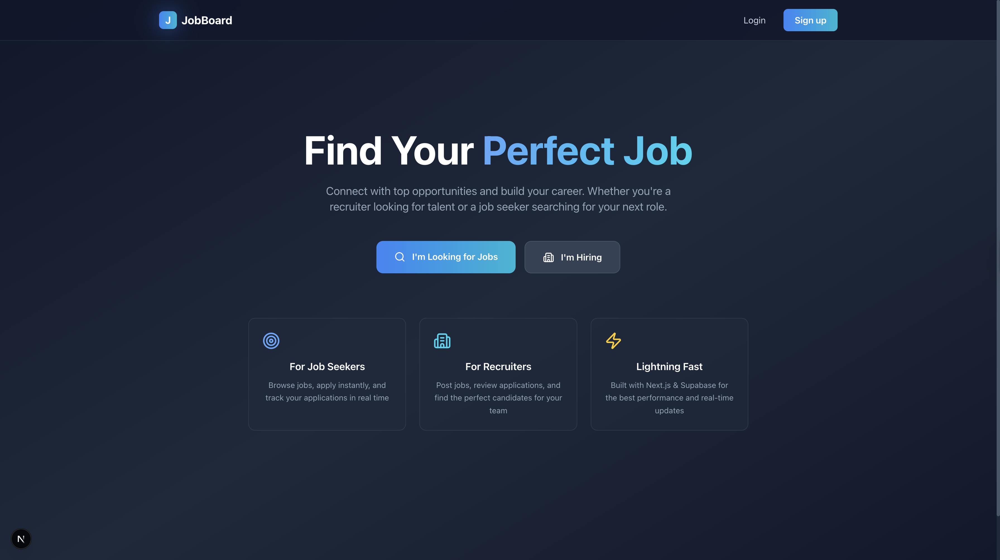
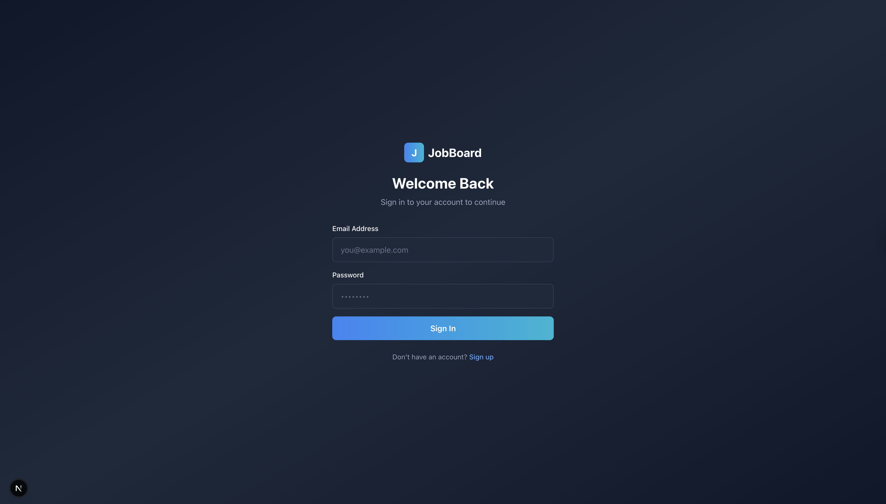
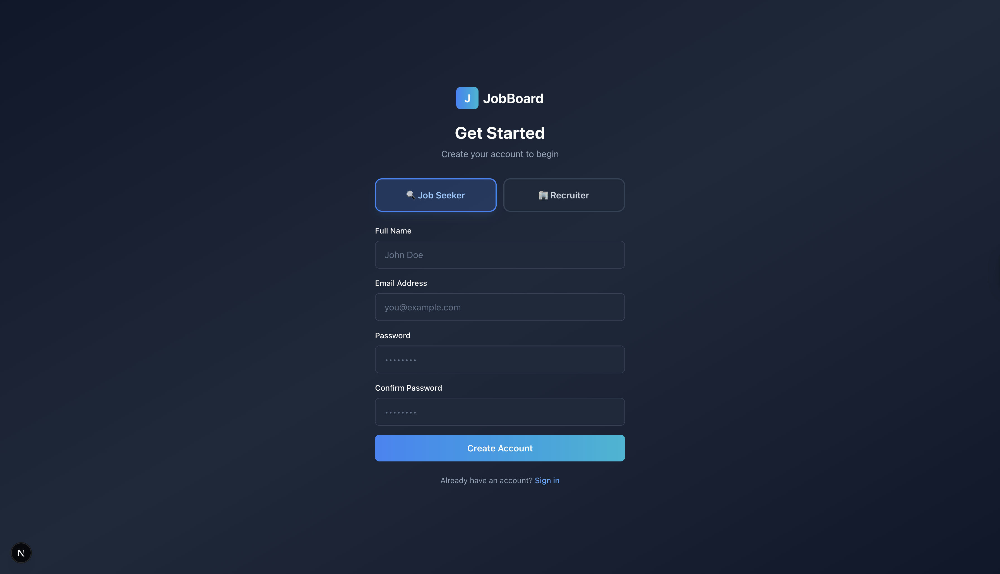
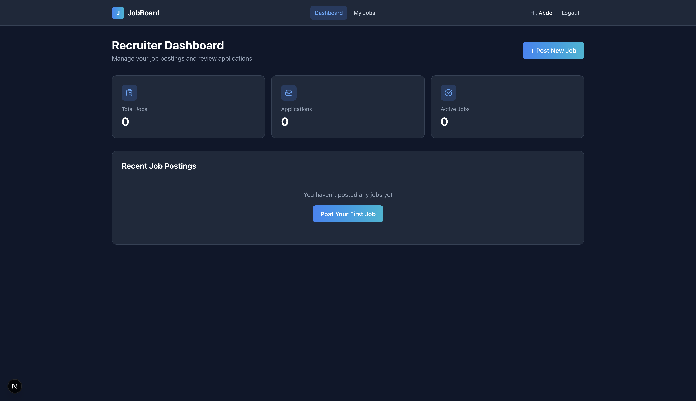
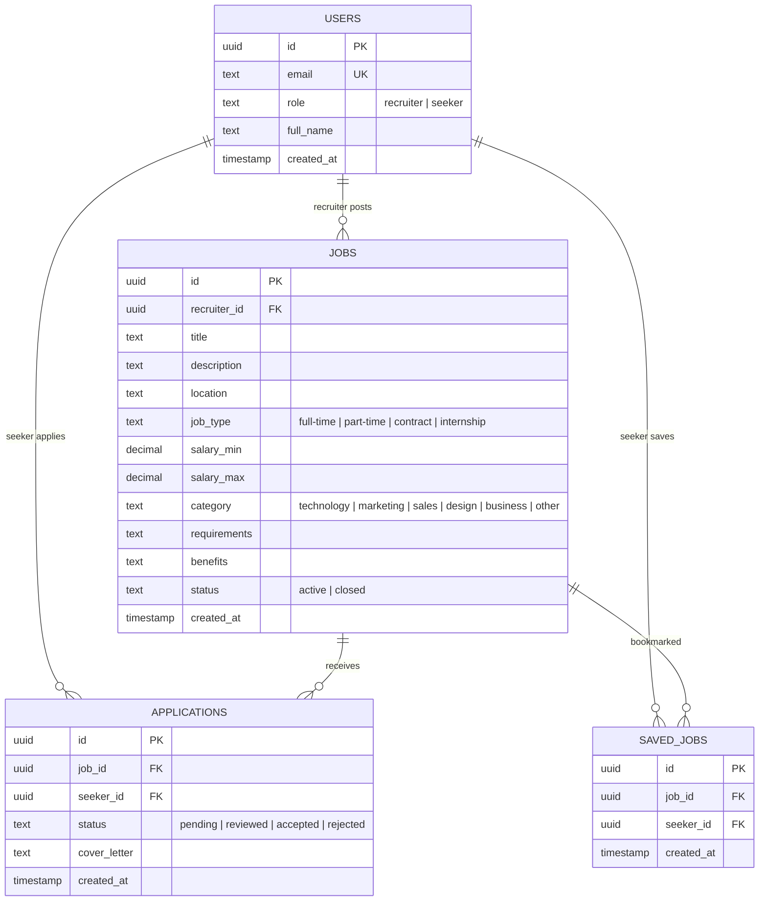

<p align="center">
  
</p>

<h1 align="center">JobBoard</h1>

<p align="center">
  A modern, full-stack job board platform connecting <strong>Recruiters</strong> and <strong>Job Seekers</strong>.<br/>
  Built with <strong>Next.js 15</strong>, <strong>Tailwind CSS</strong>, <strong>Supabase</strong>, and <strong>TypeScript</strong>.
</p>

<p align="center">
  
  
  
  
  
  
</p>

---

## 📸 Screenshots

> Replace the placeholder paths below with your actual screenshot paths.

### Landing Page



### Authentication

| Login | Sign Up |
|-------|---------|
|  |  |

### Recruiter Dashboard



### Recruiter — Job Postings

| My Jobs | Create Job | Edit Job |
|---------|------------|----------|
|  |  |  |

### Recruiter — Applications Management


### Seeker Dashboard


### Seeker — Browse & Job Detail

| Browse Jobs | Job Detail |
|-------------|------------|
|  |  |

### Seeker — Applications & Saved Jobs

| My Applications | Saved Jobs |
|-----------------|------------|
|  |  |

---

## ✨ Features

### 🔐 Authentication

- Email & password sign-up and login via **Supabase Auth**
- Role selection during sign-up (**Recruiter** or **Seeker**)
- Automatic role-based routing after login
- Protected routes with layout-level auth guards

### 👔 Recruiter Features

| Feature | Description |
|---------|-------------|
| **Dashboard** | Overview with stats (total jobs, application count, active jobs) and recent postings |
| **Post Jobs** | Create new job postings with title, description, location, type, salary range, category, requirements, and benefits |
| **Edit Jobs** | Update any field on existing job postings |
| **Delete Jobs** | Delete job postings with confirmation modal (cascading delete for applications & saved entries) |
| **Toggle Status** | Open/close job postings instantly |
| **Review Applications** | View all applicants with their cover letters, and update status (Review → Accept / Reject → Reset) |

### 🔍 Job Seeker Features

| Feature | Description |
|---------|-------------|
| **Dashboard** | Overview with stats (applications sent, saved jobs, pending count) and recent activity |
| **Browse Jobs** | Search and filter active jobs by keyword and category |
| **Job Detail** | Full job description with requirements, benefits, salary, and company info |
| **Apply** | Submit applications with an optional cover letter via a modal form |
| **Save Jobs** | Bookmark jobs with a heart icon for later review |
| **Track Applications** | Monitor application status (Pending → Reviewed → Accepted/Rejected) with filter tabs |
| **Withdraw** | Withdraw pending applications |

### 🎨 UI / UX

- Fully responsive design (mobile, tablet, desktop)
- Dark theme with glassmorphism effects
- Skeleton loading states on every page
- Smooth fade-in animations and hover micro-interactions
- Reusable component system (Button, Card, Badge, Input, Modal, StatsCard)
- **Lucide React** SVG icons throughout (no emojis)

---

## 🏗️ Tech Stack

| Layer | Technology | Purpose |
|-------|-----------|---------|
| **Framework** | Next.js 15 (App Router) | Server & client rendering, file-based routing |
| **Language** | TypeScript | Type safety across the entire codebase |
| **UI** | React 19 | Component-based UI |
| **Styling** | Tailwind CSS 3.4 | Utility-first CSS framework |
| **Icons** | Lucide React | Crisp, scalable SVG icon library |
| **Backend** | Supabase | Auth, PostgreSQL database, Row Level Security |
| **Deployment** | Vercel (recommended) | Zero-config Next.js hosting |

---

## 🗄️ Database Architecture

The app uses **Supabase** (hosted PostgreSQL) with 4 tables and Row Level Security (RLS) policies.

### Entity Relationship Diagram



### Row Level Security (RLS) Policies

| Table | Policy | Description |
|-------|--------|-------------|
| `users` | SELECT | Any authenticated user can view all profiles |
| `users` | INSERT / UPDATE | Users can only modify their own profile |
| `jobs` | SELECT | Any authenticated user can view all jobs |
| `jobs` | INSERT | Only the owning recruiter can create jobs |
| `jobs` | UPDATE / DELETE | Only the owning recruiter can modify/delete |
| `applications` | SELECT | Seekers see their own; recruiters see apps for their jobs |
| `applications` | INSERT / DELETE | Seekers can apply and withdraw |
| `applications` | UPDATE | Recruiters can update status on their job's applications |
| `saved_jobs` | SELECT / INSERT / DELETE | Seekers manage their own saved jobs |

---

## 🔗 How Supabase Is Connected

### 1. Client Initialization

The Supabase client is created in `lib/supabase.ts` using two environment variables:

```ts
import { createClient } from '@supabase/supabase-js';

const supabaseUrl = process.env.NEXT_PUBLIC_SUPABASE_URL!;
const supabaseAnonKey = process.env.NEXT_PUBLIC_SUPABASE_ANON_KEY!;

export const supabase = createClient(supabaseUrl, supabaseAnonKey);
```

### 2. Authentication Flow

```
User signs up → supabase.auth.signUp({ email, password })
                → A row is inserted into the `users` table with the same `id` as `auth.uid()`
                → User is redirected to their role-specific dashboard

User logs in  → supabase.auth.signInWithPassword({ email, password })
                → Profile is fetched from `users` table to determine role
                → Redirected to /recruiter/dashboard or /seeker/dashboard

User logs out → supabase.auth.signOut()
                → Redirected to /auth/login
```

### 3. Data Queries

All data operations use the Supabase JS client with **relational queries**:

```ts
// Fetch jobs with recruiter name (foreign key join)
const { data } = await supabase
  .from('jobs')
  .select('*, users(full_name)')
  .eq('status', 'active');

// Fetch applications with job + company info (nested join)
const { data } = await supabase
  .from('applications')
  .select('*, jobs(title, location, job_type, salary_min, salary_max, users(full_name))')
  .eq('seeker_id', user.id);
```

### 4. Security

- **RLS is enabled on all tables** — the database enforces access rules at the row level
- The `anon` key is safe to expose in the browser; RLS ensures users only see/modify what they're allowed to
- All mutations verify ownership (e.g., `eq('recruiter_id', user.id)`)

---

## 📁 Project Structure

```
job_board/
├── app/
│   ├── page.tsx                    # Landing page (hero + features)
│   ├── layout.tsx                  # Root layout (HTML + body)
│   ├── globals.css                 # Global styles & animations
│   ├── error.tsx                   # Global error boundary
│   ├── not-found.tsx               # 404 page
│   ├── loading.tsx                 # Global loading skeleton
│   ├── auth/
│   │   ├── layout.tsx              # Auth pages layout (centered card)
│   │   ├── login/page.tsx          # Login form
│   │   └── signup/page.tsx         # Sign-up form with role selection
│   ├── recruiter/
│   │   ├── layout.tsx              # Recruiter layout (Navbar + auth guard)
│   │   ├── dashboard/page.tsx      # Recruiter dashboard with stats
│   │   └── jobs/
│   │       ├── page.tsx            # Job postings list (edit/delete/toggle)
│   │       ├── create/page.tsx     # Create new job form
│   │       └── [id]/
│   │           ├── page.tsx        # Job detail + application management
│   │           └── edit/page.tsx   # Edit existing job form
│   └── seeker/
│       ├── layout.tsx              # Seeker layout (Navbar + auth guard)
│       ├── dashboard/page.tsx      # Seeker dashboard with stats
│       ├── jobs/
│       │   ├── page.tsx            # Browse & search jobs
│       │   └── [id]/page.tsx       # Job detail + apply modal
│       ├── applications/page.tsx   # Application tracking
│       └── saved/page.tsx          # Saved/bookmarked jobs
├── components/
│   ├── ui/
│   │   ├── Badge.tsx               # Status/category badge
│   │   ├── Button.tsx              # Multi-variant button
│   │   ├── Card.tsx                # Card, CardContent, CardFooter
│   │   ├── Input.tsx               # Input, Textarea, Select
│   │   └── Modal.tsx               # Reusable modal dialog
│   ├── layout/
│   │   └── Navbar.tsx              # Role-aware navigation bar
│   └── jobs/
│       ├── JobCard.tsx             # Reusable job card component
│       └── StatsCard.tsx           # Dashboard stats card
├── lib/
│   ├── supabase.ts                 # Supabase client initialization
│   └── types.ts                    # TypeScript type definitions
├── supabase-schema.sql             # Full database schema (run in SQL Editor)
├── supabase-rls-fix.sql            # RLS policy fix for user profile visibility
├── tailwind.config.js              # Tailwind configuration
├── tsconfig.json                   # TypeScript configuration
└── package.json                    # Dependencies & scripts
```

---

## 🚀 Getting Started

### Prerequisites

- **Node.js** 18+ and **npm**
- A **Supabase** project ([create one free at supabase.com](https://supabase.com))

### 1. Clone the Repository

```bash
git clone https://github.com/your-username/job_board.git
cd job_board
```

### 2. Install Dependencies

```bash
npm install
```

### 3. Set Up Supabase

1. Go to your [Supabase Dashboard](https://app.supabase.com)
2. Open the **SQL Editor** and run the full schema:
   ```
   📄 supabase-schema.sql   → Creates all tables + RLS policies
   📄 supabase-rls-fix.sql  → Fixes user profile visibility for cross-table joins
   ```
3. Go to **Settings → API** and copy your:
   - Project URL
   - `anon` public API key

### 4. Configure Environment Variables

Create a `.env.local` file in the project root:

```env
NEXT_PUBLIC_SUPABASE_URL=https://your-project-id.supabase.co
NEXT_PUBLIC_SUPABASE_ANON_KEY=your-anon-key-here
```

### 5. Run the Development Server

```bash
npm run dev
```

Open [http://localhost:3000](http://localhost:3000) in your browser.

### 6. Create Test Accounts

1. Sign up as a **Recruiter** at `/auth/signup?role=recruiter`
2. Sign up as a **Seeker** at `/auth/signup?role=seeker`
3. As the recruiter, post a few jobs
4. As the seeker, browse jobs, apply, and save

---

## 🛠️ Available Scripts

| Command | Description |
|---------|-------------|
| `npm run dev` | Start development server with hot reload |
| `npm run build` | Build for production |
| `npm start` | Start production server |
| `npm run lint` | Run ESLint |

---

## 📄 License

This project is for educational and portfolio purposes.

---

<p align="center">
  Built with ❤️ using <strong>Next.js</strong>, <strong>Tailwind CSS</strong>, and <strong>Supabase</strong>
</p>
